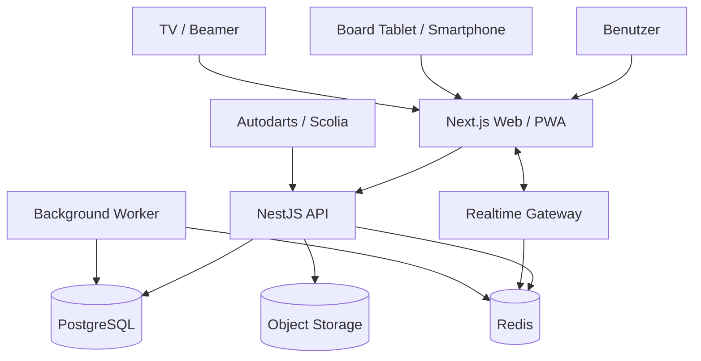

# ARCHITECTURE.md

# Dart Tournament Platform – Zielarchitektur

**Status:** Zielarchitektur Vollausbau  
**Architekturstil:** Modularer Monolith mit klaren Domänengrenzen  
**Primärplattform:** Responsive Web-App + PWA  
**Zielgeräte:** Desktop, Tablet, Smartphone, TV/Beamer  
**Sprache:** TypeScript  
**Hosting-Ziel:** Railway
**DNS:** Cloudflare
**Domain-Registrar:** Cyon
**Repository:** GitHub Monorepo

**Implementierter Stand (31. August 2026):** Die Phasen 0 bis 6 sind produktseitig
umgesetzt. Web und API decken Organisations- und Spieleradministration,
X01-Scoring, Turnierplanung und -leitung, Realtime-/Live-Flächen,
Offline-Sicherheit und Statistiken ab; der Worker aktualisiert
Karriereaggregate. Registrierungen sind nur für gültig eingeladene
E-Mail-Adressen möglich. Das Production-Projekt `dartbase` enthält erfolgreich
deployte Web-, API-, Worker-, PostgreSQL- und Redis-Services. Die öffentliche
Web- und API-Erreichbarkeit ist über `dartbase.ch` und `api.dartbase.ch`
verifiziert; beide Endpunkte besitzen gültige Railway-Zertifikate. Die folgenden
Kapitel beschreiben weiterhin das Zielbild und kennzeichnen spätere
Ausbaustufen als solche.

---

## 1. Zielbild

Die Plattform soll Dartturniere, Ligen und Turnierserien vollständig verwalten und durchführen können.

Ziele des Vollausbaus:

- Organisationen / Vereine
- Benutzer, Rollen und Berechtigungen
- Spieler und Teams
- Turniere und Turnierserien
- Ligen und Saisons
- Round Robin
- Gruppenphasen
- Single Elimination
- Double Elimination
- Schweizer System
- kombinierbare Turnierphasen
- 301 / 501 / weitere X01-Varianten
- Double In / Double Out / Master Out
- Best-of-Legs / Sets
- Boardverwaltung
- automatische Boardzuweisung
- manuelle Score-Erfassung
- Live-Scoring
- QR-Code pro Board
- TV-/Beamer-Modus
- öffentliche Turnierseiten
- Statistiken und Rankings
- PWA und Offline-Puffer
- Autodarts-Integration
- Scolia-Integration
- Benachrichtigungen
- öffentliche API
- Webhooks
- Multi-Tenant-SaaS
- Audit-Logging
- Sponsoren / Branding

---

## 2. Architekturprinzip

### 2.1 Modularer Monolith zuerst

Zum Projektstart werden keine Microservices eingesetzt.

Die Backend-Anwendung wird als modularer Monolith entwickelt:

```text
Backend
├── identity
├── organizations
├── players
├── competitions
├── tournaments
├── matches
├── scoring
├── boards
├── scheduling
├── rankings
├── statistics
├── realtime
├── notifications
├── integrations
└── audit
```

Vorteile:

- einfache lokale Entwicklung
- wenig Infrastruktur
- einfache Transaktionen
- einfacher Betrieb
- schnelleres Debugging
- trotzdem klare Domänengrenzen

Einzelne Komponenten können später aus dem Monolithen ausgelagert werden, falls Last oder organisatorische Gründe dies erfordern.

Geeignete spätere Kandidaten:

- Realtime Gateway
- Statistics Worker
- Notification Worker
- Integration Worker
- Import/Export Worker

---

## 3. Systemübersicht



---

## 4. Tech Stack

| Bereich | Technologie |
|---|---|
| Sprache | TypeScript |
| Package Manager | pnpm |
| Monorepo | Turborepo |
| Frontend | Next.js + React |
| Styling | Tailwind CSS |
| UI | shadcn/ui |
| Forms | React Hook Form |
| Server State | TanStack Query |
| Validierung | Zod |
| Backend | NestJS |
| HTTP Adapter | Fastify |
| REST API | `/api/v1` |
| Realtime | Socket.IO / WebSocket |
| Datenbank | PostgreSQL |
| ORM | Drizzle ORM |
| Cache / PubSub | Redis |
| Queue | BullMQ |
| Auth | Better Auth |
| File Storage | S3-kompatibler Object Storage |
| Unit Tests | Vitest |
| Integration Tests | Testcontainers |
| E2E | Playwright |
| Observability | OpenTelemetry |
| Error Tracking | Sentry |
| Container | Docker |
| CI/CD | GitHub Actions |
| Hosting | Railway |
| DNS / Domain | Cloudflare als autoritatives DNS, Cyon als Registrar |

---

## 5. Monorepo-Struktur

```text
dart-tournament-platform/
├── apps/
│   ├── web/
│   ├── api/
│   ├── realtime/
│   └── worker/
│
├── packages/
│   ├── domain/
│   ├── database/
│   ├── auth/
│   ├── scoring-engine/
│   ├── tournament-engine/
│   ├── league-engine/
│   ├── scheduling-engine/
│   ├── ranking-engine/
│   ├── statistics/
│   ├── integrations/
│   ├── ui/
│   ├── schemas/
│   └── config/
│
├── docs/
│   ├── architecture/
│   ├── adr/
│   ├── api/
│   └── domain/
│
├── infrastructure/
│   ├── docker/
│   └── railway/
│
├── .github/
│   └── workflows/
│
├── AGENTS.md
├── ARCHITECTURE.md
├── ROADMAP.md
└── DATABASE_SCHEMA.md
```

---

## 6. Multi-Tenancy

Die Plattform wird ab Phase 0 mandantenfähig gebaut.

Zentrale Entität:

```text
Organization
```

Nahezu alle geschäftlichen Tabellen enthalten:

```text
organization_id
```

Beispiele:

- players
- tournaments
- boards
- competitions
- integrations
- rankings
- audit_events

Tenant-Isolation ist serverseitig zwingend.

Nicht zulässig:

```sql
SELECT * FROM tournaments WHERE id = $1;
```

Ziel:

```sql
SELECT *
FROM tournaments
WHERE id = $1
  AND organization_id = $2;
```

---

## 7. Rollen und Berechtigungen

### Systemrolle

- `SUPER_ADMIN`

### Organisationsrollen

- `OWNER`
- `ADMIN`
- `TOURNAMENT_DIRECTOR`
- `SCORER`
- `MEMBER`
- `VIEWER`

### Turnierspezifische Rollen

- `TOURNAMENT_ADMIN`
- `BOARD_SCORER`
- `REFEREE`

Berechtigungen werden als Permissions modelliert:

```text
tournament:create
tournament:update
tournament:start
tournament:finish

player:create
player:update

match:start
match:score
match:undo
match:finish

board:assign
board:control

organization:manage_members
organization:manage_roles
```

Jede Mutation muss serverseitig autorisiert werden.

Die UI zeigt den Einstieg «Turnierleitung» nur, wenn die aktive oder eine andere
zugängliche Organisation `tournament:update` gewährt. Diese Sichtbarkeit ist
eine Bedienhilfe; API-Guard und Organisationszugriff bleiben die verbindliche
Sicherheitsgrenze.

Neue Konten dürfen nur angelegt werden, wenn für die normalisierte E-Mail-Adresse
eine offene, noch nicht abgelaufene Organisationseinladung und der passende
kryptografische Einladungscode vorliegen. Nach der Registrierung nimmt der
Benutzer die Einladung mit demselben Code atomisch einmalig an und erhält erst
dadurch die zugewiesene Organisationsrolle.

### Einmaliger Production-Owner-Bootstrap

Für eine leere Production-Datenbank gibt es einen separaten, kompilierten
CLI-Pfad: `pnpm db:bootstrap:production` delegiert an
`pnpm --filter @darts-platform/api bootstrap:production` und wird einmalig im
Railway-API-Container ausgeführt. Der rohe Guard verlangt `NODE_ENV=production`
und `ALLOW_PRODUCTION_BOOTSTRAP=true`, bevor vollständige Konfiguration oder
Datenbankverbindung aufgebaut werden. Ein öffentlicher Endpoint, ein
Startup-Hook, ein Default-/temporäres Passwort und manueller SQL-Bootstrap sind
ausgeschlossen.

Die pnpm-Wrapper sind Convenience-Befehle und dürfen Lifecycle-/Bannertext
ausgeben. Für maschinenlesbares Readback wird aus dem Image-Arbeitsverzeichnis
`/app` der kompilierte Node-Entry-Point direkt aufgerufen:
`node /app/apps/api/dist/operations/bootstrap-production.js`; dieser direkte
Aufruf liefert die einzelne sanitierte JSON-Zeile.

Der Pfad legt einen persistenten, nicht anmeldbaren System-Prinzipal mit der
reservierten Adresse `production-bootstrap@system.dartbase.invalid` an. Er hat
keinen Account, kein Passwort, keine Session und keine Membership und erhält
keine Tenant-Rechte. Er bleibt als referenzieller Actor für OWNER-Einladung und
Audit bestehen. Die Einladung gilt 48 Stunden; die Statuswerte `created`,
`pending` und `already-complete` sind nur für die jeweils exakt geprüften
Bootstrap-Zustände zulässig. Eine abgelaufene, passende Einladung kann als
historisierte `EXPIRED`-Zeile erneuert werden.

Die öffentliche `createInvitationSchema`- und Controller-Schreibgrenze bleibt
unverändert und lehnt `OWNER` ab. Erst die authentifizierte Registrierung mit
der eingeladenen E-Mail-Adresse und die anschließende Annahme erzeugen die
aktive OWNER-Membership. Details und der SSH-Schlüssel-Lifecycle stehen im
[ADR 0012](./docs/adr/0012-production-owner-bootstrap.md).

---

## 8. Hauptdomänen

```text
Identity
Organization
Player
Competition
Tournament
Tournament Stage
Match
Scoring
Board
Scheduling
Ranking
Statistics
Realtime
Integration
Notification
Audit
```

---

## 9. Competition-Modell

```text
Competition
├── Tournament
├── League
├── Tournament Series
└── Season
```

Das Modell erlaubt später Liga und Turnierserie, ohne den Turnierkern neu zu bauen.

Der Ligamodus ist als Team-Begegnung umgesetzt: Ein Wettbewerb vom Typ `LEAGUE`
trägt eine Begegnungsvorlage, aus der jede Begegnung ihre Slots als
eingefrorene Kopie erhält. Fachliche Grundlage dieser Regeln – Spielvarianten,
Aufstellung, Rundenfolge und Wertung – ist das
[VFC-Liga-Reglement](./LIGA-REGLEMENT.md); `league-engine` bildet es
infrastrukturfrei ab.

---

## 10. Tournament-Modell

Ein Turnier besteht aus mehreren Stages.

```text
Tournament
├── Participants
├── Stages
│   ├── Group
│   ├── Round Robin
│   ├── Swiss
│   ├── Single Elimination
│   └── Double Elimination
├── Matches
├── Boards
└── Ranking
```

Beispiel:

```text
Stage 1: 8 Gruppen à 4 Spieler
Stage 2: Last 16
Stage 3: Quarter Finals
Stage 4: Semi Finals
Stage 5: Final
```

---

## 11. Tournament Engine

Die Tournament Engine ist reine Domain-Logik.

Sie kennt:

- keine UI
- keine HTTP-Controller
- keine Datenbank
- kein Redis
- keine Railway-Infrastruktur

Module:

```text
TournamentEngine
├── RoundRobinGenerator
├── GroupGenerator
├── SingleEliminationGenerator
├── DoubleEliminationGenerator
├── SwissGenerator
├── SeedingEngine
├── QualificationEngine
└── AdvancementEngine
```

Beispiel:

```ts
const plan = tournamentEngine.generate({
  format: "GROUPS_TO_KO",
  participants: 32,
  groupStage: {
    groups: 8,
    qualifiersPerGroup: 2
  },
  knockout: {
    seedStrategy: "GROUP_POSITION"
  }
});
```

---

## 12. Scoring Engine

Die Scoring Engine bildet die Dartregeln ab.

```text
ScoringEngine
├── X01
│   ├── 301
│   ├── 501
│   ├── 701
│   └── 1001
└── spätere Spielarten
```

Konfiguration:

```text
Straight In
Double In
Straight Out
Double Out
Master Out
Best of Legs
Best of Sets
```

Sie validiert:

- Score
- Bust
- Restscore
- Checkout
- Dartanzahl
- Leg-Ende
- Set-Ende
- Match-Ende
- Undo / Revert

---

## 13. Match-Domäne

```text
Match
├── MatchParticipants
├── Sets
│   └── Legs
│       └── Visits
│           └── optional Darts
└── Result
```

Ein Visit enthält mindestens:

```text
id
organization_id
match_id
leg_id
player_id
sequence
score
dart_count
remaining_before
remaining_after
bust
checkout
created_at
created_by
```

Optional:

```text
dart_1
dart_2
dart_3
```

---

## 14. Domain Events

Wichtige Änderungen werden als Domain Events behandelt:

```text
MATCH_STARTED
LEG_STARTED
VISIT_RECORDED
VISIT_BUST
VISIT_REVERTED
LEG_WON
SET_WON
MATCH_WON
MATCH_FINISHED
BOARD_ASSIGNED
RANKING_UPDATED
```

Historische Scoring-Daten werden möglichst nicht destruktiv gelöscht.

Undo:

```text
VISIT_RECORDED
↓
VISIT_REVERTED
```

---

## 15. Concurrency

Jedes aktive Leg besitzt eine Version.

Beispiel:

```text
version = 17
```

Command:

```json
{
  "score": 140,
  "expectedVersion": 17,
  "commandId": "uuid"
}
```

Nach erfolgreichem Commit:

```text
version = 18
```

Ein weiterer Command mit Version 17 wird abgewiesen.

Zusätzlich müssen Score-Commands idempotent sein.

---

## 16. Board Control

Ein Board besitzt:

```text
Board
├── activeMatch
├── controller
├── heartbeat
└── controllerExpiresAt
```

Redis-Key:

```text
board:{boardId}:controller
```

Der Controller-Lock besitzt einen Timeout.

Ein zweites Gerät kann das Board erst übernehmen, wenn der Lock freigegeben wurde oder abgelaufen ist.

---

## 17. Realtime

Realtime wird für folgende Oberflächen benötigt:

- Scoring
- Turnierleitung
- Live-Seite
- TV-Modus
- Match-Ansicht
- Boardstatus

Channels:

```text
organization:{id}
tournament:{id}
match:{id}
board:{id}
```

Datenfluss:

```text
Score Command
↓
API
↓
PostgreSQL Commit
↓
Domain Event / Outbox
↓
Redis Pub/Sub
↓
Realtime Gateway
↓
Clients
```

Grundregel:

> Persistieren vor Broadcast.

---

## 18. REST API

Mutationen laufen grundsätzlich über HTTP.

Beispiele:

```text
POST /api/v1/tournaments
POST /api/v1/tournaments/:id/start
POST /api/v1/matches/:id/start
POST /api/v1/matches/:id/visits
POST /api/v1/matches/:id/undo
POST /api/v1/boards/:id/assign
```

Realtime verteilt Zustandsänderungen an Clients.

---

## 19. Score Provider

Manuelle und automatische Score-Erfassung verwenden dieselbe Abstraktion.

```text
Match Engine
    │
Score Provider
 ┌──┴─────────────┐
 │                │
Manual         External
              ├── Autodarts
              └── Scolia
```

Beispielinterface:

```ts
export interface ScoreProvider {
  startMatch(matchId: string): Promise<void>;
  stopMatch(matchId: string): Promise<void>;
  subscribe(handler: (visit: ExternalVisit) => void): () => void;
}
```

Externe Anbieter dürfen nie direkt Turnier- oder Matchtabellen verändern.

---

## 20. Scheduling Engine

Ziel:

> Nicht einfach „nächstes Match auf nächstes freies Board“.

Bewertung berücksichtigt:

- freie Boards
- Matchstatus
- Spieler verfügbar?
- Spieler spielt gerade?
- Ruhezeit seit letztem Match
- Turnierphase
- Matchpriorität
- manuell gesperrte Boards
- abhängige Matches

Spielerstatus:

```text
AVAILABLE
CALLED
PLAYING
RESTING
ABSENT
ELIMINATED
```

---

## 21. Board-QR-Code

Jedes physische Board erhält einen permanenten QR-Code:

```text
https://app.example.com/b/{publicBoardCode}
```

Der QR-Code enthält keine Match-ID.

Das aktive Match wird serverseitig zum Board aufgelöst.

---

## 22. PWA und Offline

Die Score-Oberfläche wird als PWA gebaut.

Ziele:

- installierbar
- Fullscreen
- touch-optimiert
- lokale Assets
- schneller Start
- kurze Netzwerkunterbrüche tolerieren

Offline-Queue:

```text
PendingCommands
├── command 101
├── command 102
└── command 103
```

Beim Reconnect:

```text
Client
↓
Sync
↓
Version Check
↓
Server Commit
```

Vollständig serverloses Turniermanagement ist nicht Ziel des ersten Offline-Modus.

---

## 23. Ranking Engine

Ranking-Regeln sind konfigurierbar.

Beispiel Gruppenranking:

```text
1. Match Points
2. Leg Difference
3. Legs Won
4. Head-to-Head
5. Average
```

Ranking-Logik darf nicht im Frontend liegen.

Der `rankingHistory`-Verlauf aus `packages/statistics` ist eine
**Karriereauswertung, keine ligaweite Rangliste**: er rechnet Elo mit K = 24 ab
1500 paarweise über die Matches der betrachteten Person und führt dabei die
Bewertung des tatsächlichen Gegners mit. Weil die Eingabe nur die Matches dieser
Person enthält, bewegt sich die Gegnerbewertung nur in den gemeinsamen
Begegnungen. Eine ligaweite, konfigurierbare Rangliste gehört in
`packages/ranking-engine` (ROADMAP Phase 10) und existiert noch nicht.

---

## 24. Statistics

Mögliche Statistiken:

- Matches
- Wins / Losses
- Average
- First 9 Average
- Checkout %
- Checkout Attempts
- Highest Checkout
- Highest Score
- 100+
- 120+
- 140+
- 160+
- 180
- Best Leg
- Darts per Leg
- Head-to-Head
- Formkurve
- Career Stats

Später werden Aggregationen asynchron über Worker erzeugt.

---

## 25. Transactional Outbox

Kritische Events werden über Outbox zuverlässig weitergegeben.

```text
BEGIN

INSERT visit
UPDATE leg
INSERT outbox_event

COMMIT
```

Worker verteilt anschließend:

```text
Realtime
Statistics
Notifications
Webhooks
```

Beide Konsumenten führen je Zeile einen Versuchszähler und einen
Dead-Letter-Stempel. Ein Ereignis, das fünfmal scheitert, wird übersprungen
und als `outbox.dead_letter` protokolliert, statt die Schlange anzuhalten.

---

## 26. Background Jobs

BullMQ + Redis.

Jobs:

```text
GenerateStatistics
RebuildRanking
SendNotification
ProcessWebhook
ProcessImport
GenerateExport
GenerateReport
```

---

## 27. Public Portal

Aktuell implementierte öffentliche Routen:

```text
/live/:tournamentId
/live/:tournamentId/board/:boardId
/live/:tournamentId/tv
```

Gruppenranglisten, K.-o.-Tableau, Boardzustände und QR-Codes verwenden eine
schreibgeschützte öffentliche API-Projektion. Spielerprofile unter
`/spieler/:id` sind organisationsgebunden und benötigen eine Sitzung.

---

## 28. TV-Modus

Route:

```text
/live/:tournamentId/tv
```

Eigenschaften:

- Fullscreen
- große Typografie
- keine Navigation
- Live Boards
- nächste Matches
- Resultate
- Sponsoren
- automatische Rotation

---

## 29. Security

Mindestanforderungen:

- HTTPS only
- Secure Cookies
- CSRF-Schutz
- Content Security Policy
- Security Headers
- serverseitige Validierung
- Rate Limiting
- RBAC / Permissions
- Tenant Isolation
- einladungsgebundene Registrierung
- Audit Logging
- Secret Management
- Dependency Scanning
- regelmäßige Backups
- Restore-Tests
- keine Secrets im Repository

Security Headers: `apps/api/src/common/security-headers.ts` (Helmet, harte
Content Security Policy) und `apps/web/next.config.ts` (CSP vorerst
Report-Only, siehe Umstellungskriterium dort). Rate Limiting:
`apps/api/src/common/rate-limit.ts` setzt einen prozesslokalen Zähler mit
Stufen (`general`/`public`/`sensitive`) je Route; Better Auths eigener
`customStorage` über Redis zählt verteilt, aber nur für Sign-in und Sign-up.
`TRUST_PROXY_HOPS` bestimmt, welcher `X-Forwarded-For`-Eintrag als
Client-Adresse für beide Zähler gilt und ist in Production Pflicht.

---

## 30. Audit Logging

Kritische Aktionen:

```text
MATCH_RESULT_CHANGED
VISIT_REVERTED
PLAYER_REMOVED
TOURNAMENT_RESET
MATCH_MANUALLY_FINISHED
BOARD_CONTROL_TAKEN_OVER
USER_ROLE_CHANGED
MEMBER_INVITED
MEMBER_DEACTIVATED
MEMBER_REACTIVATED
INTEGRATION_CHANGED
```

Audit-Daten:

```text
organization
actor
action
entityType
entityId
timestamp
oldValue
newValue
ip
userAgent
correlationId
```

---

## 31. Observability

Von Beginn an:

- strukturierte Logs
- Correlation IDs
- Health Endpoints inklusive Outbox-Rückstand je Konsument
- Metrics
- Error Tracking
- später Distributed Tracing

Tech:

```text
OpenTelemetry
Sentry
Grafana optional
```

---

## 32. Testing

### Unit

Hohe Testabdeckung für:

- Scoring Engine
- Tournament Engine
- Ranking Engine
- Scheduling Engine

### Integration

- API
- PostgreSQL
- Redis
- Auth

### End-to-End

Playwright-Szenario:

```text
Turnier erstellen
↓
Spieler hinzufügen
↓
Gruppen generieren
↓
Match starten
↓
Scores erfassen
↓
Match abschließen
↓
Ranking prüfen
↓
KO-Runde generieren
```

---

## 33. Deployment auf Railway

Railway PostgreSQL bleibt die verbindliche Datenbank für Production und
Staging. Neon wird ausschließlich für isolierte Development- und kurzlebige
Preview-Branches eingesetzt. Production-Zugangsdaten und unmaskierte
Production-Daten werden nicht nach Neon übertragen. Die verbindlichen Regeln
stehen in [ADR 0011](./docs/adr/0011-preview-database-strategy.md).

Aktuell angelegte Produktionsstruktur zum 31. August 2026:

```text
BitWhatElse Projects
└── Railway-Projekt: dartbase
    └── Environment: production
        ├── @darts-platform/web
        ├── @darts-platform/api
        ├── @darts-platform/worker
        ├── Postgres
        └── Redis
```

Alle fünf Services sind erfolgreich deployt. Die Railway-IaC bildet den
Live-Stand einschließlich Worker, Domains, Volumes und Service-Konfigurationen
ab; der kontrollierte Production-Plan meldet keine Änderungen. Das separate
Release-Hardening-Plan setzt für die drei GitHub-gebundenen Services später
`checkSuites: true`; bis dieser Plan geprüft, freigegeben und angewendet ist,
darf aus der aktuellen IaC-Konfiguration kein aktives Railway-CI-Gate abgeleitet
werden.

Domain- und DNS-Fluss:

```text
Cyon (Registrar)
  └── NS-Delegation -> Cloudflare (autoritativer DNS, DNS only)
                         ├── dartbase.ch   -> Railway Web
                         ├── *.dartbase.ch -> Railway Web
                         ├── api.dartbase.ch -> Railway API
                         └── _acme-challenge -> Railway DNS Authorization
```

`dartbase.ch` und `*.dartbase.ch` belegen die zwei Custom-Domain-Slots des
Railway-Hobby-Tarifs am Web-Service. Beide Zertifikate sind gültig. Cloudflare
bleibt zunächst für alle Railway-Einträge auf `DNS only`; insbesondere darf der
ACME-CNAME nicht proxied werden. `api.dartbase.ch` ist über einen expliziten
CNAME am API-Service angelegt, verifiziert und mit einem gültigen Zertifikat
erreichbar.

Öffentlich vorgesehen:

```text
dartbase.ch       -> web
*.dartbase.ch     -> web; Hostname-Auflösung und Tenant-Zuordnung erfolgen in der App
api.dartbase.ch   -> api
```

Nur intern:

```text
PostgreSQL
Redis
Worker
interne API-Verbindungen
```

Railway Private Networking wird für Service-to-Service-Kommunikation verwendet.
Die erforderliche öffentliche API-Domain wird als exakter Eintrag am API-Service
konfiguriert; dessen eigene Domain-Slots werden durch Root und Wildcard am
Web-Service nicht verbraucht.

---

## 34. Zielarchitektur Vollausbau

```text
                         Internet
                            │
                        CDN / WAF
                            │
                ┌───────────┴───────────┐
                │                       │
              Web                    Public API
                │                       │
                └───────────┬───────────┘
                            │
                            API
                            │
             ┌──────────────┼──────────────┐
             │              │              │
         Tournament       Scoring       Scheduler
             │              │              │
             └──────────────┼──────────────┘
                            │
                       PostgreSQL
                            │
                          Outbox
                            │
                          Queue
                            │
         ┌──────────────────┼──────────────────┐
         │                  │                  │
     Statistics        Notifications      Integrations
                                             │
                                   ┌─────────┴─────────┐
                                   │                   │
                               Autodarts             Scolia

Realtime Gateway
       │
      Redis
       │
Web / PWA / TV / Public Live
```

---

## 35. Architekturregeln

1. Business-Logik niemals im React UI.
2. Tournament Engine kennt keine Datenbank.
3. Scoring Engine kennt keine Benutzeroberfläche.
4. PostgreSQL ist Source of Truth.
5. Redis ist niemals einzige Quelle kritischer Daten.
6. Alle geschäftlichen Daten sind tenant-isoliert.
7. Jede Mutation wird serverseitig autorisiert.
8. Score-Commands sind idempotent.
9. Aktive Matches verwenden Optimistic Concurrency.
10. Integrationen verwenden Adapter.
11. Drittanbieter ändern keine Domain-Daten direkt.
12. Realtime erst nach erfolgreicher Persistierung.
13. Historische Scores möglichst nicht destruktiv ändern.
14. Kritische Aktionen werden auditiert.
15. Kern-Engines benötigen hohe Unit-Test-Abdeckung.
16. Kein Microservice ohne nachgewiesenen Bedarf.
17. Keine Secrets im Repository.
18. Keine direkte Datenbankverbindung aus dem Frontend.
19. API-Verträge werden versioniert.
20. Neue Architekturentscheidungen werden als ADR dokumentiert.
